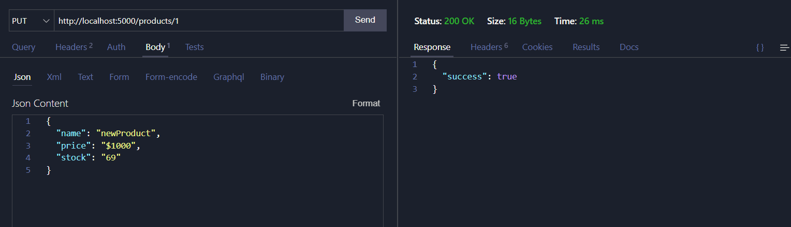

<h1 align="center">Express Server API products</h1>
<p align="center">
  <a href="https://github.com/twiistrzdev/djs-bot-template">
    
  </a>
</p>

## Installation
```sh-session
git clone https://github.com/Ryuux/CrudAPIJSON
```
```sh-session
npm install
```
```sh-session
npm run start
```

## Preview


## Author
> GitHub [@Ryuux](https://github.com/Ryuux)

> Discord [@Ryox,,,#2109](https://discord.com/channels/@me/1026242381034561647)

> Twitter [@iloveryuux](https://twitter.com/iloveryuux)
